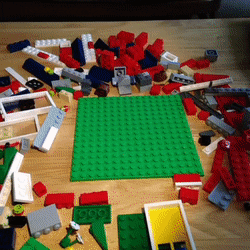

```{r setup, include=FALSE}
library(knitr)
library(printr)
library(tidyverse)
library(ggplot2)
library(magrittr)
knitr::opts_chunk$set(echo = TRUE, error=TRUE
                     , class.error='error'
                     , class.warning='warning'
                     , class.message='message'
                     , cache=FALSE)
options( repos="https://cran.rstudio.org"
       , width=60
       )
```


# Plots

```{r echo=FALSE, purl=FALSE, message=FALSE, dev='svg'}
library(ggridges)
library(viridis)
ggplot(lincoln_weather, aes(x = `Mean Temperature [F]`, y = `Month`, fill = ..x..)) +
  geom_density_ridges_gradient(scale = 3, rel_min_height = 0.01) +
  scale_fill_viridis(name = expression(paste("Temperature [",degree,"F]"))
                    , option = "C") +
  labs(title = NULL)
```

## Packages

### Must have

* [`ggplot2`](https://cran.r-project.org/package=ggplot2)
* [`viridis`](https://cran.r-project.org/package=viridis)

### Extras to check out

* [`ggridges`](https://cran.r-project.org/package=ggplot2)


## Thought Exercise:

> What are we trying to do with graphics?

## Example: What are the components?

```{r, echo=FALSE, message=FALSE}
ggplot(data = readRDS("bordeaux.rds"), aes(x=CoatesPoints, y=Price) ) + 
    geom_point() + 
    geom_smooth() +
    labs(x =  "Wine Rating")
```

## Graphics Systems in R

1. Base
2. Grid
3. Grammar

## Base Graphics{.flexbox .vcenter}

Don't waste your time.

## Grid Graphics{.flexbox .vcenter}

An even bigger waste of time.


# Grammar of Graphics

{.float-right}


##

The grammar of graphics is built with different components or blocks.

:::{.center}

:::

## Building blocks: Aesthetics

* Aesthetics
    * location
    * size
    * shape
    * height
    * width
    * area
    * color
        - fill
        - border
    * transparency
    * ~~time/animation~~

## Building blocks: Data

* Aesthetics...
* Data 
    - map variables from data to aesthetics
    - Statistics, i.e. how to summarize the data:
        + outliers, Q1, Median Q3, outliers &#8594; Box plots
        + binning &#8594; histograms 
        + density &#8594; density, violin, etc.
        + smoothing: loess, splines, etc.


## Building blocks: Coordinates

* Aesthetics...
* Data 
* Coordinate System
    + Cartesian
    + Geographic
    + Polar
    + Scaling
        - Logarithmic
        - Square-root
        

## Building blocks: Facets

* Aesthetics...
* Data 
* Coordinate System
* Facets
    * Grid
    * Strip
    * Wrap 


## Terminology

:::{.terminology}
Data
    
: What we are visualizing

Geometry

: The type of visualization.

Mapping

: How variables translate variables from data to aesthetic components
  of the graph.

Statistic

: If and how variables are to be summarized prior to being mapped to
  aesthetics.

:::

## Terminology

:::{.terminology}
Coordinates

: How Axes are displayed.

Facets

: How a visualization is to be broken into parts.

Position

: How elements should be positioned; sitter, stacked, dodge, etc.

:::

## Example
```{r ebola.plot1, results='hide'}
library(ggplot2)
load("data/ebola.data.RData")
ebola.plot1 <- 
ggplot(data=ebola.data) +               #< Our 'data' component
    geom_point(                         #< a point geometry layer
        aes( x = `Country Report Date`  #< our mappings
           , y = `Total cases`
           , col = Country
           )                         
      , stat = 'unique'                 #< our statistic  
      , position = 'identity'           #< how to position data
    )
```

## Example
```{r dependson=ebola.plot1}
ebola.plot1
```
We can do better.

## Layers

:::{.terminology}
Layers

: Layers are the combination of a geometry, data, mapping, statistic, and position.

    Graphs may have and often do have many layers in them.
:::

{.float-right}

## Layered Example

```{r ebola.plot2, results='hide'}
library(ggplot2)
load("data/ebola.data.RData")
ebola.plot2 <- 
ggplot(data= ebola.data %>% select(2:4, 6) %>% distinct()
        #< Move mappings here because inheritance.
      , aes( x = `Country Report Date`   
           , y = `Total cases`
           , col = Country
           )                         
      ) +               
    geom_point( stat = 'unique'
              , size = 1         #< An explicit aesthetic. 
              ) + 
    geom_smooth(method='gam', formula=y ~ s(x, bs = "cs")) +   #< new 'smooth' layer
    facet_wrap(~`Case def.`, 2, 2)  #< new 2x2 faceting for Case def. 
```

## Layered Example

```{r dependson=ebola.plot2, warning=FALSE, message=FALSE, dev='svg'}
ebola.plot2
```

## Changing Aesthetics

```{r ebola.plot3, echo=FALSE, warning=FALSE, message=FALSE, dev='svg'}
ebola.plot3 <- 
    ggplot(data= ebola.data %>% select(2:4, 6) %>% distinct() %>% 
             # Filtered to the three countries hardest hit
             filter(Country %in% c("Guinea", "Liberia", "Sierra Leone"))
        #< Move mappings here because inheritance.
      , aes( x = `Country Report Date`   
           , y = `Total cases`
           , col = `Case def.`
           )                         
      ) +               
    geom_point( stat = 'unique'
              , size = 1         #< An explicit aesthetic. 
              ) + 
    geom_smooth(method='gam', formula=y ~ s(x, bs = "cs")) +   #< new 'smooth' layer
    facet_wrap(~Country, 6, 1)  #< new 2x2 faceting for Case def.
```
```{r warning=FALSE, message=FALSE, dev='svg', class.output="Rplot"}
ebola.plot3
```


## A comment about color
```{r messages=FALSE, warning=FALSE}
ebola.plot3 + scale_color_viridis_d()
```

## Themes{.build}

Themes are what control the non-data elements of a visualization

* Axes
* Grid
* Background
* Legend positioning, etc.

### Built-in themes

::::::{.columns-2}
:::{.column}
* `theme_grey`
* `theme_bw`
* `theme_linedraw`
* `theme_light`
:::
:::{.column}
* `theme_dark`
* `theme_minimal`
* `theme_classic`
:::
::::::

## Theme Example, Dark

```{r messages=FALSE, warning=FALSE}
ebola.plot3 + scale_color_viridis_d() + theme_dark()
```

## Theme Example, Minimal

```{r messages=FALSE, warning=FALSE}
ebola.plot3 + scale_color_viridis_d() + theme_minimal()
```


## Customizing themes

```{r messages=FALSE, warning=FALSE}
ebola.plot3 + scale_color_viridis_d() + theme_minimal() + 
    theme(legend.position="top"
         , strip.background=element_rect(fill='black')
         , strip.text= element_text(color='gold', face='bold'))
```

## Reuse your theme

```{r}
my.theme <- theme_minimal() + theme(legend.position="top",
    strip.background=element_rect(fill='black'), 
    strip.text= element_text(color='gold', face='bold'))
ebola.plot1+my.theme
```

## The Shortcut `qplot` (quick plot)

```{r}
plotting.data <- ebola.data %>% filter(`Case def.`=='Confirmed')
qplot(`Total cases`, `Total deaths`, color = Country, data=plotting.data)
```


## Exercises with Bordeaux Wines

1. Parker Points vs. Coates Points
2. Parker Points or Coates Points vs. Price
3. Price by First Growth or Cult Wine
4. A plot that includes at least
    a. Price
    b. Parker Points or Coates Points
    c. two of First Growth, Cult Wine, Pomerol, or Vintage Superstar

:::{#timer-plots .timer onclick="startTimer()" warnafter=120}
10:00
:::

## Solution: Preliminary

Fix the wine data so that the labels for indicators are a little nicer.


```{r "fix_wine_data", dependson="wine.data"}
#assign back pipe
wine <- read.csv("data/Bordeaux.csv") %>% 
        mutate_at( vars(FirstGrowth:VintageSuperstar)
                 , ~forcats::fct_recode(factor(.), No='0', Yes='1')
                 )
```

## Solution: Parker Points vs. Coates Points
```{r dependson="fix_wine_data"}
qplot(data=wine, ParkerPoints, CoatesPoints, geom='point')
```

## Solution: Parker Points vs. Price
```{r dependson="fix_wine_data"}
qplot(data=wine, ParkerPoints, Price, geom='point') + 
    labs(y = 'Price(\uA3)', x="Robert Parker Rating (Max:100)")
```

## Solution: Price by First Growth Box plot
```{r dependson="fix_wine_data"}
qplot(data=wine, x=FirstGrowth, y=Price
     , geom='boxplot', group=FirstGrowth) #< must include a group.
```

## Solution: Price by First Growth Density
```{r dependson="fix_wine_data"}
ggplot(data=wine) + geom_density(aes(x=Price, fill=FirstGrowth), alpha=0.5)+
    scale_fill_viridis_d()
```

## Solution: Price by First Growth Violins

```{r dependson="fix_wine_data"}
ggplot(data=wine) + geom_violin(aes(y=Price, x=FirstGrowth, fill=FirstGrowth))+
    scale_fill_viridis_d()
```

## Solution: Price by First Growth Guitar Plot
```{r dependson="fix_wine_data", purl=FALSE, fig.keep='none'}
ggplot(data=wine) + geom_violin(aes(y=Price, x=FirstGrowth, fill=FirstGrowth))+
    scale_fill_viridis_d()
```


## Solution: all the variables.
```{r all.the.variables, dependson="fix_wine_data"}
all.the.variables <- ggplot(data=wine) + 
    # Five variables here.
    geom_point(aes( x   = ParkerPoints, y   = CoatesPoints
                  , col = Price, shape = Pomerol:VintageSuperstar
                  )
              # Jitter the position to avoid over-plotting
              , position=position_jitter(.4, .4))+
    # grid for two more variables
    facet_grid( FirstGrowth~CultWine
              , labeller=label_both 
              ) + #^ Labels have both variable name and level.
    # Make colors pop for high value wines.
    scale_color_viridis_c(trans = 'log10', option="inferno", end=0.75) + 
    labs( x = "Robert Parker Rating (Max:100)"
        , y = "Clive Coates Rating (Max:20)"
        , color = 'Price(\uA3)')
```

## Solution: all the variables.

```{r dependson="all.the.variables"}
all.the.variables
```
